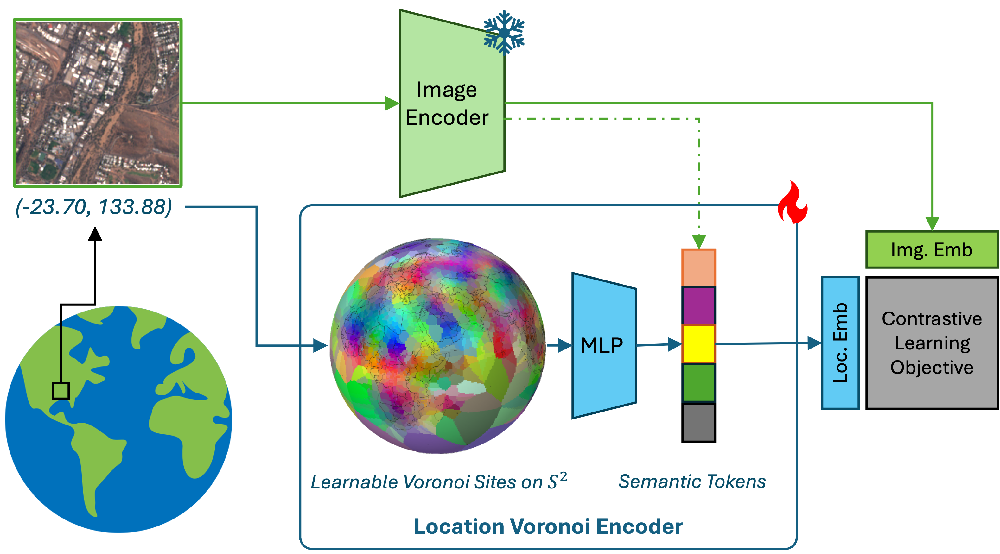
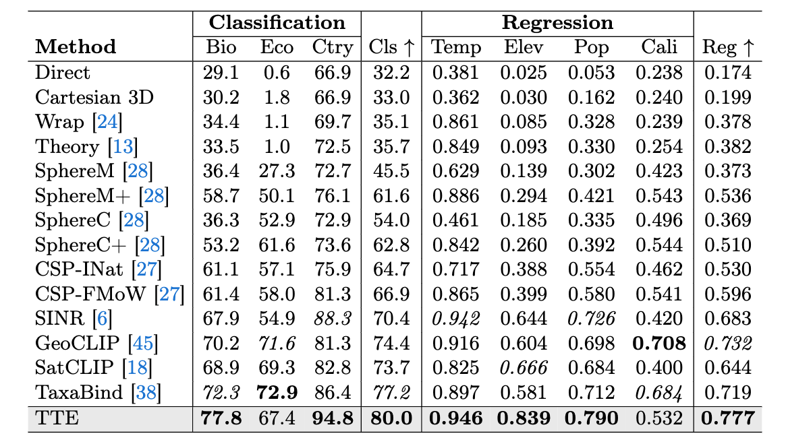
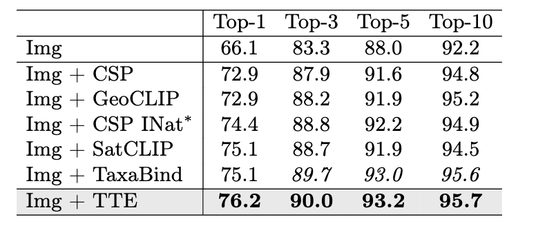
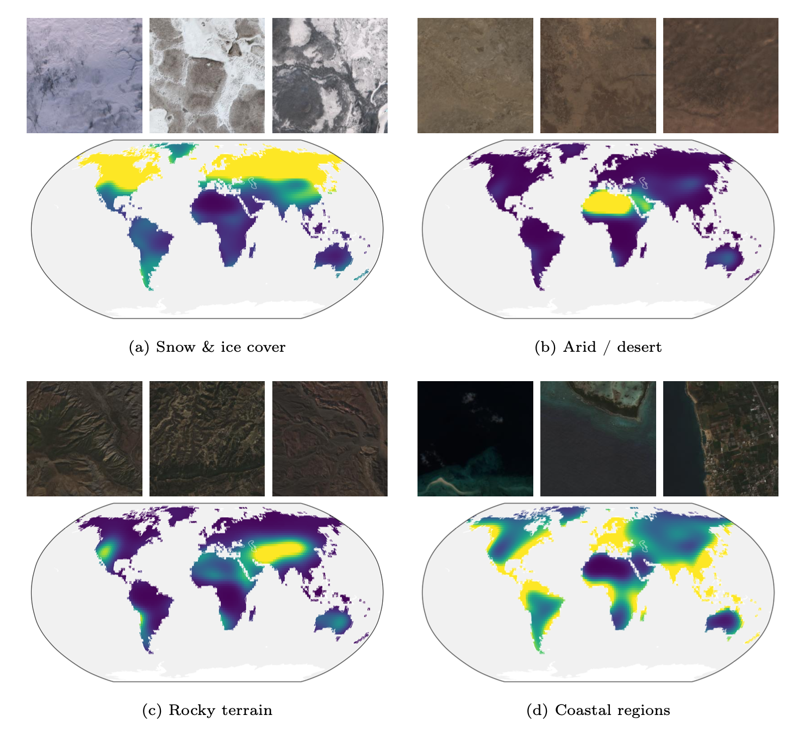

<div align="center">

# Tessellating the Earth (TTE)

### Learnable Spherical Voronoi Partitions for Location Encoding

[](#)
[](#)
[](https://dcher95.github.io/TTE/)
[](https://huggingface.co/MVRL/TTE)

<sub>Daniel Cher · Hamza Iqbal · Eric Xing · Brian Wei · Nathan Jacobs — Washington University in St. Louis · [MVRL](https://mvrl.cse.wustl.edu/)</sub>

</div>

<p align="center">
  
</p>

TTE is a **location encoder** that contrastively aligns a `(lat, lon)` with Sentinel-2 satellite imagery generating a dense embedding for downstream tasks.
It uses a  **learnable Spherical Voronoi partition** of S². A small set of **global semantic tokens** distills shared visual concepts from the imagery into a compact vocabulary the encoder references at inference, letting geographically distant sites covering similar environments share semantics.

> 🌍 **See it learn:** the [interactive project page](https://dcher95.github.io/TTE/)
> shows the Voronoi sites migrating and the location field forming *during training*.

## Install

```bash
pip install -r requirements.txt          # inference only
# or, for training / evaluation:
conda env create -f environment.yaml && conda activate tte
```

## Quick start

```python
import torch
from tte import TTE

model = TTE.from_pretrained("MVRL/TTE").eval()      # ~14 MB, location encoder only

coords = torch.tensor([[37.77, -122.42],               # San Francisco — (lat, lon) in degrees
                       [-3.12,   60.02]])               # Amazon
emb = model.encode(coords)                             # (N, 512), L2-normalized
sim = emb @ emb.t()                                    # cosine similarity
```

`load_tte_model` accepts a HuggingFace repo id **or** a local checkpoint:

```python
from tte import load_tte_model
model = load_tte_model("path/to/last.ckpt")            # or "MVRL/TTE"
```

## Results

TTE sets a new state of the art among parametric location encoders on a variety of geospatial benchmarks (left) and as a geographic prior for iNaturalist-2018 species classification (right).

<table align="center"><tr>
  <td valign="middle"></td>
  <td valign="middle">&nbsp;&nbsp;</td>
  <td valign="middle"></td>
</tr></table>

## Global semantic tokens

<p align="center">
  
  <br><sub>Global semantic tokens learn coherent visual concepts. For each token: the Sentinel-2 imagery it most attends to (top) and its attention map across the globe (bottom).</sub>
</p>

## Citation

```bibtex
@inproceedings{cher2026tte,
  title     = {Tessellating the Earth: Learnable Spherical Voronoi Partitions for Location Encoding},
  author    = {Cher, Daniel and Iqbal, Hamza and Xing, Eric and Wei, Brian and Jacobs, Nathan},
  booktitle = {European Conference on Computer Vision (ECCV)},
  year      = {2026}
}
```

## 🔍 Additional Links

Check out our lab website for other interesting works on geospatial understanding and mapping:
* Multi-Modal Vision Research Lab (MVRL) - [Link](https://mvrl.cse.wustl.edu/)
* Related Works from MVRL - [Link](https://mvrl.cse.wustl.edu/publications/)
* See our other location encoder work - [Link](https://github.com/mvrl/RANGE)

## Acknowledgements

Frozen image backbone from [SSL4EO-S12](https://github.com/zhu-xlab/SSL4EO-S12);
evaluation uses the [RANGE](https://github.com/mvrl/RANGE) benchmark suite. Released
under the terms in [LICENSE](LICENSE).
